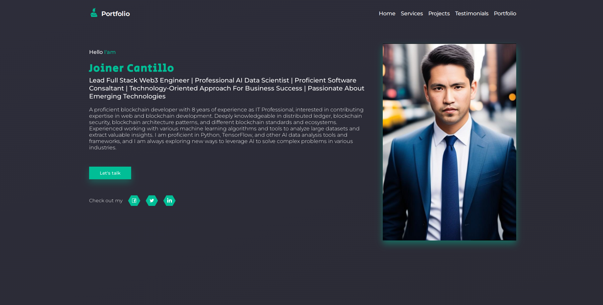

## Portfolio using React js and styled-components 2023

## Features

Lead Full Stack Web3 Engineer |
 Professional AI Data Scientist |
  Proficient Software Consaltant |
   Technology-Oriented Approach for Business Success |
    Passionate about Emerging Technologies

## Description

A proficient blockchain developer with 8 years of experience as IT Professional, interested in contributing expertise in web and blockchain development. Deeply knowledgeable in distributed ledger, blockchain security, blockchain architecture patterns, and different blockchain standards and ecosystems.   
Experienced working with various machine learning algorithms and tools to analyze large datasets and extract valuable insights. I am proficient in Python, TensorFlow, and other AI data analysis tools and frameworks, and I am always exploring new ways to leverage AI to solve complex problems in various industries.

